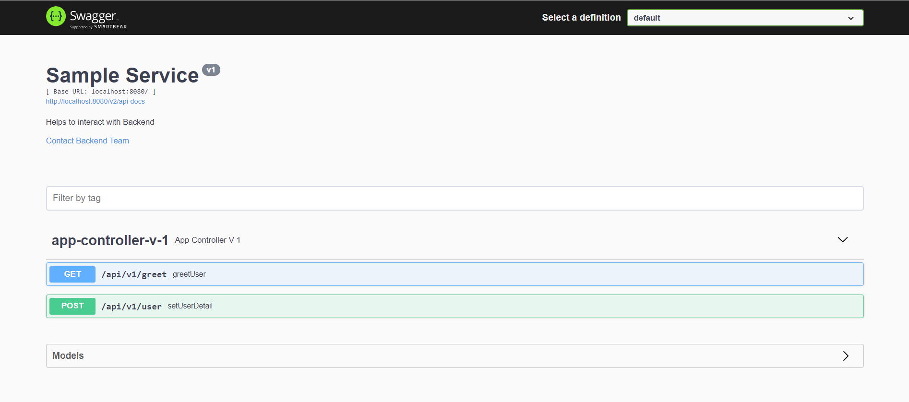
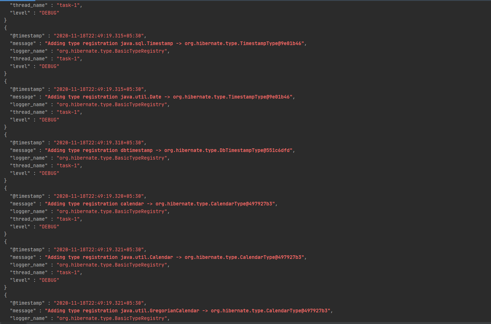

# SPRING BOOT MULTI MODULE PROJECT

This project aims to help the developer to start with spring boot multi-module project quickly. Logging, Exception handling, security are enabled by default.
As of now logging and security module are strictly tied to Microsoft azure. All logs and exceptions are continuously tracked in Microsoft Application Insight.

## LIBRARIES
- [api-docs](#api-doc)
- [file-handler](#file-handler)
- [logging](#logging)
- [security](#security)
- [utility](#utility)

### api-docs
Enable swagger by only adding **@EnableDocs** annotation on Main Class.

``` JAVA
package sample_service;

import apidocs.annotations.EnableDocs;
import org.springframework.boot.SpringApplication;
import org.springframework.boot.autoconfigure.SpringBootApplication;

@SpringBootApplication
@EnableDocs
public class Application {
    public static void main( String[] args ) { SpringApplication.run(Application.class, args);}
}

```


### file-handler

### logging

Out of the box logging


### security

Enable security by only adding **@EnableSecurity** annotation on Main Class.

``` JAVA
package sample_service;

import apidocs.annotations.EnableDocs;
import org.springframework.boot.SpringApplication;
import org.springframework.boot.autoconfigure.SpringBootApplication;
import security.annotations.EnableSecurity;

@SpringBootApplication
@EnableDocs
@EnableSecurity
public class Application {
    public static void main( String[] args ) { SpringApplication.run(Application.class, args);}
}

```
### utility
